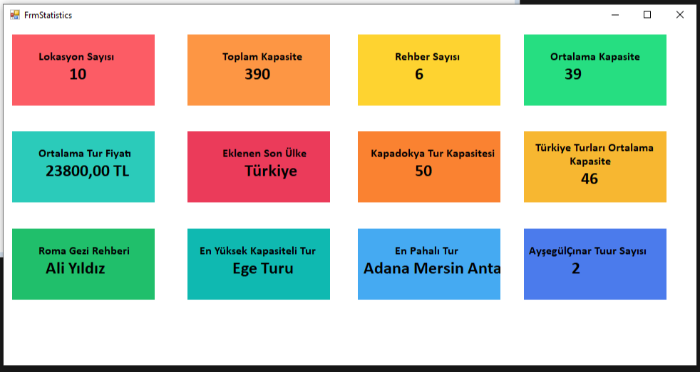
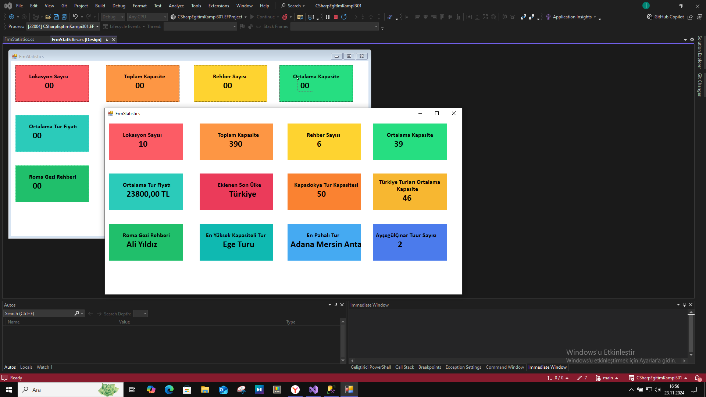

DERS 11 : PROJENÝN 301 MODÜLÜNE HEÇTÝK. 4 KATMANLI PROJEYE BAÞLADIK. CODEFÝRTS MANTIÐINI ÖÐRENDÝK.

DERS 12 : DATA ACCESS KATMANI VE CCONTEXT SINIFI ÖÐRENDÝK. KATMANLARI BÝRBÝRÝNE REFERANS GÖSTERDÝK.

DERS 13 : OOP MODÜLÜ: MIGRATION ÝÞLEMLERÝ VE ABSRACT INTERFACELER  ÖÐRENDÝK.

DERS 14 : ORM YAPISINI. ETITY FRAMEWORK DBFIRST MODEL OLUÞTURMAYI ÖÐRENDÝK.

DERS 15 : ETITY FRAMEWORK DERSÝNE DEVAM ETTÝK  VE PROJE UYGULAMASI YAPMAYA BAÞLADIK. 

DERS 16 : ENTITY FRAMEWORK TUR ÞÝRKETÝ LOCATÝON ÝÞLEMLERÝ . FORMDAN TUÞLARI VE ÝÞLEVLERÝNÝ YARLADIK. YENÝ BÝR WINDOWSFORM OLUÞTURUP YAPTIK.

DERS 17 : ENTÝTY FRAMEWORK DEVAM VE LINQ SORGULARI ÖÐRENMEYE BAÞLADIK.

# DERS 17 TUR ÞÝRKETÝ ÇALIÞMAMIZ

DERSÝMÝZDE 15. DERSTE YAPIMINA BAÐLADIÐIMIZ TUR ÞÝRKETÝ PROJEMÝZ ÝLE ALAKALI ÇALIÞTIK.  
YENÝ BÝR FORM AÇIP SQL'DEKÝ VERÝLERÝ FORM UYGULAMAMIZDA GÖRÜNTÜLEDÝK.  
MESELA EN PAHALI TURU, EN SON EKLENEN TURU, TUR FÝYATI, LOKASYON SAYISI, ORTALAMA TUR FÝYATI GÝBÝ VERÝLERÝ NASIL FORMUMUZA EKLEYECEÐÝMÝZÝ ÖÐRENDÝK.  
FORMUMUZUN ARKA PLAN RENGÝNÝ BAÞKA YERDEN, BAÞKA PALETLERDEKÝ RENKLERÝ ALARAK EKLEMEYÝ ÖÐRENDÝK.  

---

### Çalýþmamýzýn Ekran Görüntüsü 1:

---

### Çalýþmamýzýn Ekran Görüntüsü 2:

---

DERS 18 : ENTITYSTATE KOMUTLARI , GENERIC REPOSITORY SINIFI VE  EF  SINIFLARI

DERS 19 : EÐÝTÝMÝN 401 KISMINA GÝRÝÞ YAPTIK. BUSÝNESS KATMANI VE LOGÝC KURALLARI

DERS 20 : DEPENDENCY INJECTIONÖÐRENDÝK. BÝR ÖNCEKÝ DERS DEÐÝNMÝÞTÝK AMA BU DERS DÝREKT DETAYLI ÖÐRENDÝK.

DERS 21 : ENTITY FRAMEWORK ÖZGÜ METODLAR YAZDIK.

DERS 22 : 

